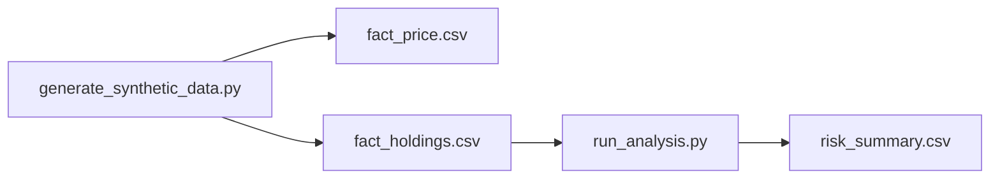

# Financial Risk & Portfolio Lab (Synthetic)

**Author:** Faiz Elahi · **Type:** EDUCATIONAL PORTFOLIO LAB · **SYNTHETIC DATA ONLY**

---

## Educational disclaimer / synthetic data

This lab uses **synthetic prices, holdings, and trades** for a fictional multi-asset book. No real fund, bank, or client portfolio is modeled.

Use honest language: *“I simulated historical VaR and concentration metrics on synthetic market data.”*

---

## Problem statement (detailed)

Market risk teams quantify **downside** and **concentration** for trading books:

- **Historical VaR** — Quantile of daily portfolio returns from price history.
- **Holdings weights** — Market value by ticker vs total NAV.
- **P&L attribution** — Contribution of positions to last-day move (simplified here).

Students need transparent Python/pandas math on `fact_price`, `fact_holdings`, and `fact_trade` rather than a black-box vendor engine—while understanding this is **not** regulatory FRTB or Basel sign-off.

---

## Why this tool

| Vendor risk dashboard | This lab pipeline |
|-----------------------|-------------------|
| Hidden assumptions | Visible return aggregation in `run_analysis.py` |
| Static PDF | CSV outputs + VaR histogram PNG |
| No teaching data | Reproducible synthetic price paths |

Pairs with **`ibm-watsonx-analytics-lab`** (positions + notes) and **`snowflake-healthcare-finance-elt-lab`** (finance ELT theme).

---

## Architecture



See [`docs/architecture.md`](docs/architecture.md).

---

## Dataset dictionary (tables / columns)

| File | Grain | Key columns | Notes |
|------|-------|-------------|-------|
| `dim_security.csv` | Instrument | `ticker`, `asset_class`, `sector` | Reference dimension |
| `fact_price.csv` | Price day | `date`, `ticker`, `close_price` | Daily closes |
| `fact_holdings.csv` | Position | `ticker`, `shares` | Weights normalized in code |
| `fact_trade.csv` | Trade | `trade_date`, `ticker`, `quantity`, `side` | Activity log |
| `risk_summary.csv` | Metric | `metric`, `value` | VaR 95% and 99% daily |
| `concentration.csv` | Ticker | `weight`, `market_value` | Top holdings |
| `pnl_attribution_last_day.csv` | Ticker | Last-day P&L contribution | Simplified attribution |

---

## Prerequisites

- Python 3.10+
- `pandas`, `numpy`, `matplotlib` (see `requirements.txt`)

---

## Step-by-step: how to run

### Windows PowerShell

```powershell
cd financial-risk-portfolio-lab
python -m venv .venv
.\.venv\Scripts\Activate.ps1
pip install -r requirements.txt
python scripts/generate_synthetic_data.py
python src/run_analysis.py
```

### Optional bash

```bash
cd financial-risk-portfolio-lab
python3 -m venv .venv && source .venv/bin/activate
pip install -r requirements.txt
python scripts/generate_synthetic_data.py
python src/run_analysis.py
```

---

## File-by-file walkthrough

| Path | Role |
|------|------|
| `scripts/generate_synthetic_data.py` | Securities, prices, holdings, trades |
| `src/run_analysis.py` | Portfolio returns, VaR, concentration, P&L slice, histogram |
| `data/risk_summary.csv` | VaR metrics output |
| `docs/images/var_histogram.png` | Return distribution with VaR lines |

---

## Expected outputs and how to interpret them

- **`risk_summary.csv`** — Negative quantiles of daily portfolio returns (loss tail convention—verify sign in class).
- **`concentration.csv`** — Largest weights; discuss limits vs policy thresholds.
- **`pnl_attribution_last_day.csv`** — Which tickers moved NAV on the last price date.
- **Histogram** — Visual link between dispersion and VaR lines.

Returns use **pct_change** on aligned price matrix with **normalized share weights**.

---

## Results interpretation

- **Historical VaR** assumes the past repeats—stress tests and parametric VaR are out of scope.
- **Single-day attribution** ignores transaction costs and fx (not modeled).
- Synthetic correlations may **understate tail risk** vs crisis periods.

---

## Glossary (8+ terms)

1. **VaR** — Value at Risk; loss threshold at a confidence level over a horizon.
2. **Historical simulation** — VaR from empirical return quantiles.
3. **NAV** — Net asset value of the portfolio.
4. **Concentration** — Weight of largest positions.
5. **P&L attribution** — Decomposing daily change by position.
6. **Ticker** — Instrument symbol in price/holdings tables.
7. **Holdings grain** — One row per ticker shares in `fact_holdings.csv`.
8. **Quantile** — Percentile of return distribution (95%, 99%).
9. **Market risk** — Loss from price moves—not credit/operational risk here.

---

## Common mistakes (5+)

1. Calling this **“production risk engine”** experience in interviews.
2. Using **absolute VaR** without stating **horizon and confidence**.
3. Mixing **gross and net exposure** when weights are normalized long-only here.
4. Ignoring **corporate actions** (splits/dividends—not in synthetic prices).
5. Applying **regulatory capital numbers** from educational CSVs.
6. Forgetting to **regenerate prices** after seed changes before comparing runs.

---

## Exercises (5+)

1. Add **parametric VaR** assuming normal returns—compare to historical.
2. Compute **Herfindahl index** on weights for concentration.
3. Extend to **rolling 60-day VaR** time series plot.
4. Join **`dim_security.csv`** sector labels to attribution table.
5. Link conceptually to **`ibm-watsonx-analytics-lab`** health-sector positions.
6. Document **backtesting** steps for VaR exceptions (conceptual).

---

## Limitations / simulation vs production

- No options greeks, fixed income curves, or fx multi-currency books.
- Long-only simplified weights; no short or leverage rules.
- Not validated against vendor engines (Bloomberg, Murex, etc.).
- Educational code—**not investment advice or regulatory reporting**.

---

## Related labs

- [`ibm-watsonx-analytics-lab`](../ibm-watsonx-analytics-lab/) — Positions SQL + note classification metaphor.
- [`aws-health-finance-lake-lab`](../aws-health-finance-lake-lab/) — Finance transactions in a lake pattern.
- [`snowflake-healthcare-finance-elt-lab`](../snowflake-healthcare-finance-elt-lab/) — Finance ELT on claims/payments.

---

**Author:** Faiz Elahi · Educational portfolio use.
